# Ask GPT-5.2-Codex, Gemini & 200+ Models — Without Leaving Claude Code

<div align="center">

**Get instant second opinions, code reviews, and architecture feedback directly inside Claude.**

*No context switching. No copy-paste. Just ask.*

<a href="https://openrouter.ai"></a> **Uses your own [OpenRouter API key](https://openrouter.ai/keys)** — no middleman, no telemetry, you're in control.

[30-Second Install](#-quick-start) •
[See It Work](#-how-it-works) •
[Examples](#-examples) •
[Uninstall](#-uninstall)

---

> **This project was reviewed and improved by GPT-5.2-Codex via OpenRouter** — proving the tool works! See the [contribution details](#-built-with-multi-model-collaboration).

</div>

## Why You'll Love This

- **Instant code review** from GPT-5.2-Codex without leaving Claude
- **Compare approaches** across different LLMs in one conversation
- **Catch edge cases** by getting a second opinion in seconds
- **Stay in flow** — no tab switching, no context loss

> *"Ask GPT-5.2-Codex to review this function"* — that's it. Claude handles the rest.

This MCP server lets Claude query **200+ models** via [OpenRouter](https://openrouter.ai/models) — all in the same conversation.

## 🎯 How It Works

```mermaid
flowchart TD
    A[You + Claude Code] -->|"Ask GPT-5.2-Codex to review"| B[Claude Hub - MCP Bridge]
    B --> C[OpenRouter API]
    C --> D[GPT-5.2 Codex]
    C --> E[Gemini 2.5]
    C --> F[DeepSeek R1]
    D --> G[Response via Claude]
    E --> G
    F --> G
    G --> H[You get the answer ✅]
```



**Just ask naturally — Claude handles the rest:**

```
You: "Write a function to parse CSV files"

Claude: [writes the function]

You: "Ask GPT-5.2-Codex if there's a better approach"
      ~~~~~~~~~~~~~~ ← just name the model you want

Claude: [calls OpenRouter API → GPT-5.2-Codex]

Claude: "GPT-5.2-Codex suggests using a streaming parser for large files..."

You: "Good idea, let's update it"

Claude: [updates the code]
```

No special commands needed. Just say "ask GPT-5.2-Codex", "have Gemini review", "get DeepSeek's opinion" — Claude figures out which model to call.

## ✨ Features

| Feature | Description |
|---------|-------------|
| **200+ Models** | GPT-5.2-Codex, Gemini, DeepSeek, Llama, Mistral, and more |
| **Same Session** | No switching apps or copying code |
| **Your Context** | Other models see what you're working on |
| **Quick Access** | Just ask Claude to get another opinion |

## 📋 Prerequisites

| Requirement | Where to get it |
|-------------|-----------------|
| **Claude Code CLI** | [claude.ai/download](https://claude.ai/download) (requires Pro subscription) |
| **Node.js 18+** | [nodejs.org](https://nodejs.org) |
| **OpenRouter Account** | [openrouter.ai](https://openrouter.ai) (free tier available) |
| **OpenRouter API Key** | [openrouter.ai/keys](https://openrouter.ai/keys) |

## 🚀 Quick Start

### Option A: Download ZIP (no git needed)

1. **Download:** [Click here to download ZIP](https://github.com/stefans71/Claude_GPT_MCP/archive/refs/heads/main.zip)
2. **Extract** the ZIP file (you'll get `Claude_GPT_MCP-main` folder)
3. **Open terminal in that folder:**
   - **Windows:** Right-click folder → "Open in Terminal"
   - **Mac:** Right-click folder → "New Terminal at Folder"
   - **Linux:** Right-click → "Open Terminal Here"
4. **Run the installer:**
   ```bash
   ./setup.sh
   ```
   Windows users may need: `bash setup.sh`

### Option B: Clone with git

```bash
git clone https://github.com/stefans71/Claude_GPT_MCP.git
cd Claude_GPT_MCP
./setup.sh
```

### Option C: Install on a VPS/Remote Server

**1. SSH into your VPS and navigate to your home directory (or wherever Claude Code is installed)**

```bash
ssh user@your-server.com
cd ~
```

**2. Run this one-liner:**

```bash
curl -sL https://github.com/stefans71/Claude_GPT_MCP/archive/refs/heads/main.tar.gz | tar -xz && cd Claude_GPT_MCP-main && ./setup.sh
```

That's it! This downloads, extracts, and runs setup in one command. No git required.

**3. Restart Claude Code and you're ready.**

**VPS Notes:**
- Your OpenRouter API key is stored in `~/.claude.json` (passed directly to the MCP server)
- For Docker/containerized Claude: set `OPENROUTER_API_KEY` as an environment variable

---

The installer handles everything:
- ✓ Installs dependencies
- ✓ Prompts for your OpenRouter API key
- ✓ Configures Claude Code automatically

**Restart Claude Code and you're ready.**

## 💬 Examples

### Get a Second Opinion
```
"Ask GPT-5.2-Codex to review this function"
"What would Gemini do differently here?"
"Have DeepSeek check this for edge cases"
```

### Compare Approaches
```
"Ask GPT-5.2-Codex and Gemini how they'd implement this"
"Get Claude and GPT-5.2-Codex's opinion on this architecture"
```

### Specialized Tasks
```
"Ask GPT-5.2-Codex to optimize this algorithm"
"Have DeepSeek explain this regex"
"Get Gemini's take on this SQL query"
```

### Explore Models
```
"What models are available?"
"Show me models good for coding"
"Set my default to GPT-5.2-Codex"
```

## 🔧 Management

### Check Your Setup
```bash
./setup.sh --show-key   # View API key (masked)
./setup.sh --help       # All options
```

### Change API Key
```bash
./setup.sh --set-key
```

Or just ask Claude: *"Change my OpenRouter API key"*

## 🗑️ Uninstall

### What Gets Removed?

| Component | Removed? | Details |
|-----------|----------|---------|
| OpenRouter from Claude | **Yes** | Only the `"openrouter"` entry in `~/.claude.json` — your other Claude settings stay intact |
| Your API key | **Optional** | You choose — the script asks before removing |
| The folder | **Manual** | You delete it yourself after uninstalling |

**Important:** This only removes OpenRouter. Your other Claude Code settings and API keys for other services are untouched.

---

### Using the Uninstaller Script

**1. Open your terminal**
- **Windows:** Open PowerShell or Command Prompt
- **Mac:** Open Terminal (Applications → Utilities → Terminal)
- **Linux:** Open your terminal

**2. Navigate to where you installed it**

If you downloaded the ZIP:
```bash
cd ~/Downloads/Claude_GPT_MCP-main    # or wherever you extracted it
```

If you cloned with git:
```bash
cd Claude_GPT_MCP    # or wherever you cloned it
```

**3. Run the uninstaller**
```bash
./setup.sh --uninstall
```

**4. Follow the prompts**
- It will ask to remove OpenRouter from Claude Code → **Yes**
- It will ask to remove your API key → **Your choice** (Yes = removes the `OPENROUTER_API_KEY` line from your shell config)

**5. Restart Claude Code**

---

### Delete the Files (Optional)

After running the uninstaller, you can delete the folder:

```bash
# First, exit the folder
cd ..

# Then delete it
rm -rf Claude_GPT_MCP-main    # if you used ZIP
rm -rf Claude_GPT_MCP         # if you used git
```

**Windows users:** Just delete the folder normally in File Explorer.

---

<details>
<summary><b>Manual Uninstall (if the script doesn't work)</b></summary>

This works for both ZIP downloads and git clones.

**Step 1: Remove OpenRouter from Claude Code config**

Open `~/.claude.json` in a text editor:
```bash
# Mac/Linux
nano ~/.claude.json

# Windows (in PowerShell)
notepad $env:USERPROFILE\.claude.json
```

Find and delete ONLY the `"openrouter": { ... }` section. Keep everything else.

**Before:**
```json
{
  "mcpServers": {
    "openrouter": {
      "command": "node",
      "args": ["/path/to/dist/index.js"]
    },
    "other-server": { ... }
  }
}
```

**After:**
```json
{
  "mcpServers": {
    "other-server": { ... }
  }
}
```

**Step 2: Remove API key (optional)**

Open your shell config:
```bash
# Mac
nano ~/.zshrc

# Linux
nano ~/.bashrc
```

Find and delete the line:
```
export OPENROUTER_API_KEY="sk-or-..."
```

**Step 3: Delete the folder**
```bash
# Mac/Linux
rm -rf /path/to/Claude_GPT_MCP

# Windows - just delete the folder in File Explorer
```

</details>

## 📁 Where Things Live

| File | What it does |
|------|--------------|
| `~/.claude.json` | Claude Code config + your API key (in env section) |
| `~/.config/openrouter-mcp/config.json` | Your preferences (default model, favorites) + API key backup |

## 🐛 Troubleshooting

**"OPENROUTER_API_KEY not set"**
```bash
./setup.sh --set-key
```

**MCP not loading**
```bash
claude --mcp-debug
```

**Model not found**
```
"What models are available?"
```

---

## Built with Multi-Model Collaboration

This project practices what it preaches. **GPT-5.2-Codex reviewed and improved this codebase** via OpenRouter, demonstrating real multi-model workflows:

| Reviewed by GPT-5.2-Codex | Improvements Made |
|---------------------------|-------------------|
| `setup.sh` | Fixed macOS compatibility, improved error handling, added config backups |
| `package.json` | Added missing metadata, keywords, proper exports |
| `README.md` | Made more enticing, added trust/security section |

This is exactly how the tool is meant to be used — Claude writes code, another model reviews it, and you get better results.

## Privacy & Security

- **Your API key stays local** — stored only on your machine
- **Direct to OpenRouter** — requests go straight to OpenRouter, not through any middleman
- **No telemetry** — we don't collect any data
- **Open source** — inspect the code yourself

## Cost

OpenRouter offers a **free tier** with many models available at no cost. Pay-per-use pricing for premium models. See [openrouter.ai/models](https://openrouter.ai/models) for current pricing.

---

<div align="center">

**Built for Claude Code users who want more perspectives**

MIT License

[Report Issue](https://github.com/stefans71/Claude_GPT_MCP/issues) •
[OpenRouter Models](https://openrouter.ai/models) •
[OpenRouter](https://openrouter.ai)

</div>
